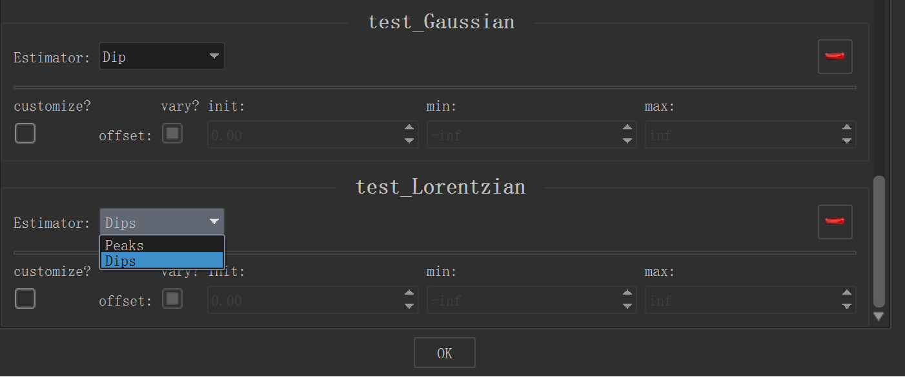
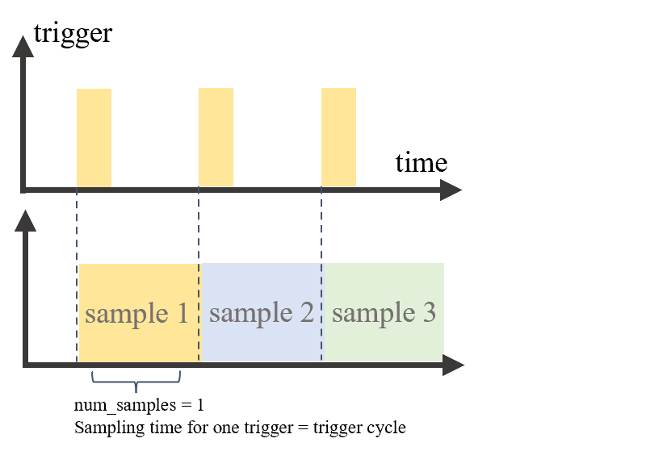
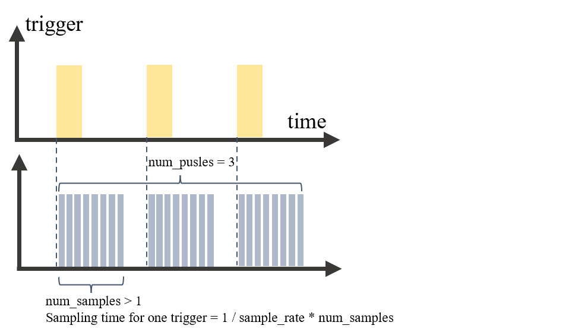
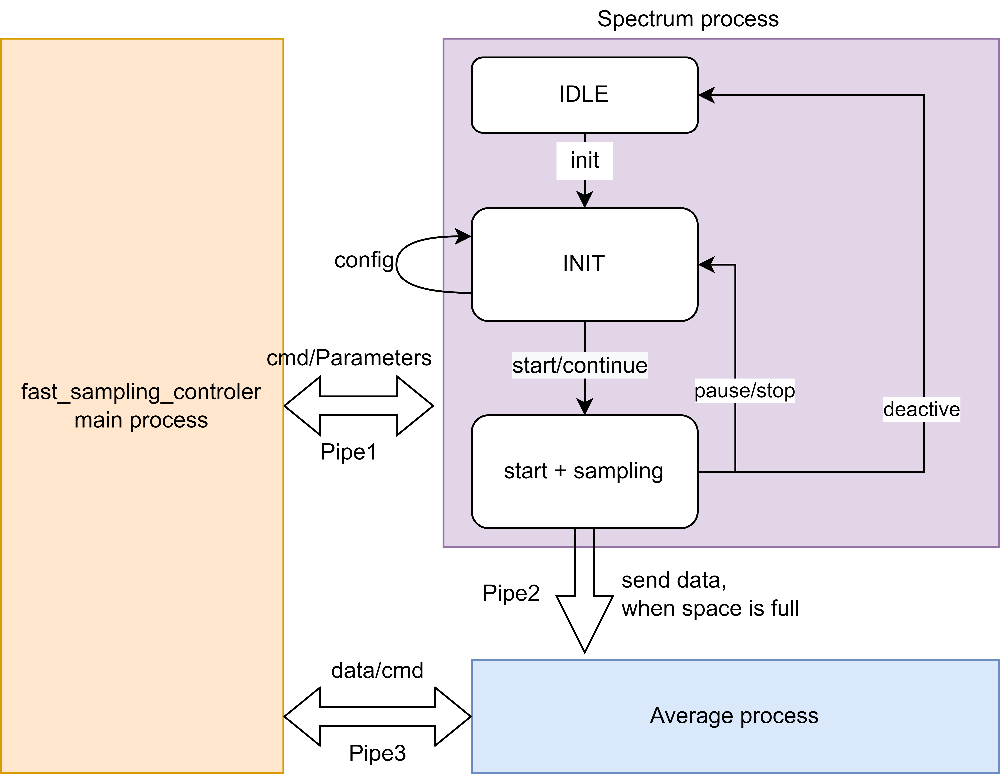

# Qudi Interface Development Doc
---
## 1. Interface of Tabor
### 1.1 Common Problems

1. some common commands can not be executed
> **\*WAI**: It was marked in official doc but can not be identified by tabor hardware, i choose time.sleep() to replace this command.

> **\*OPC?** : No matter what state the system is in, always return **OFF**.

> **:LIST ON?** : List mode is very special in Tabor. Because it always returns **OFF**, although it can also work in this mode. I use a software method to mark the state of list in hardware file of Tabor.

> **\*RST** : Reset Command in Tabor seems make no sense. So for *SWEEP MODE* and *LIST MODE*, the only way to reset both modes (it means, let the output back to the first Frequency) is to firstly turn off the output, then initialize the parameters again, finally turn on the output. Anyway it seems Tabor doesn`t support the *soft switching Tech*.

2. Some strange Properties of Tabor:
> Tabor doesn`t support Pyvisa and cannot be identified by NI MAX, use Pyusb to solve this problem.

> Tabor cannot normally work in low Frequency as what in its official doc said. It can only normally work above about 300 MHZ.


### 1.2 Guide of qudi-Tabor
The involvoed Programm is divided into two parts:
1. **taborConfiguration.cfg** as a configuration document;
2. **mw_source_tabor.py**, which locates in hardware file dictionary, is called by odmr_logic and supports the main functions of Tabor.

In **taborConfiguration.cfg**, the relevant codes are as follows:
- first part:
   ```
   odmr_logic:
        module.Class: 'odmr_logic.OdmrLogic'
        connect:
            microwave: tabor_12G
            data_scanner: ni62xx_finite_sampling_input
   ```
   here the content after microwave is optional:
   | Device      | Description                   | USB_Adress    |
   | ----------- | -----------                   |---            |
   | tabor_12G   | 2 Channels, max. 12 GHz output| 0x1202        |
   | tabor_3G    | 2 Channels, max. 3 GHz output | 0x3002        |

- second part:
   ```
   tabor_12G:
        module.Class: 'microwave.mw_source_tabor.MicrowaveTabor'
        options:
            channel : 1                 
            teVendorId  : 0x168C
            teLucidDesktopId  : 0x6002  # Use this for Lucid Desktop - 6GHz
            teLucidPortableId : 0x6081  # Use this for Lucid Portable - 6GHz + 1 Channel
            teLucidBenchtopId : 0x1202  # Use this for Lucid Benchtop - 12GHz + 2 Channels
            BUFFER_SIZE : 256
      ...
   ```
   this part is about some detailed information of each device.

In **mw_source_tabor.py**, the relevant codes are as follows:
```
class MicrowaveTabor(MicrowaveInterface):
   ...
   def on_activate(self):
      # used to connect the device with PC and configure basic parameters

   def on_deactivate(self):
      # used to disconnect the device with PC

   def set_cw(self, frequency, power):
      # configure the parameters in CW mode, which related to frequency and power, and make sure the LIST mode and SWEEP mode are closed.

   def configure_scan(self, power, frequencies, mode, sample_rate):
      # cofigure the parameters in corresponding mode, using parameters we have given before

   def off(self):
      # switch off the microwave output
   
   def cw_on(self):
      # Switches on cw microwave output.
   
   def start_scan(self):
      # Qudi`s logic, using the selected mode and parameters to start scanning. Firstly make sure the corresponding parameters have been successfully written, and then the output is opened.

   def reset_scan(self):
      # only for SWEEP and LIST mode, return to the first state of thedefined list of parameters. Because Tabor dosen`t support a soft reset, this function is important.
   
   def readData(self, data)  &  def _command_wait(self, command_str):
      # used to read data / send data through USB
   
   def _in_list_mode(self):
      # Determine whether the current state is in the LIST mode and return a Boolean variable.
      # ATTENTION: Tabor has some problem of returning a right state of LIST, here I use a variable self._list_state to replace it.

    def _in_sweep_mode(self):
      # Determine whether the current state is in the SWEEP mode and return a Boolean variable.

    def _in_cw_mode(self):
      # Determine whether the current state is in the CW mode and return a Boolean variable.

    def _write_list(self):
      # write parameters of LIST mode.

    def _write_sweep(self):
      # write parameters of SWEEP mode.

    def _set_trigger_edge(self):
      # set the effective direction of trigger.
```

---
## 2. Datafitting in qudi-core

### 2.1 relevant doc
1. One .py document in qudi-core is modified:
   >...\qudi\util\fit_models\helpers.py
2. One .py document in qudi-core is additionally added to the folder:
   >...\qudi\util\fit_models\Npeak.py
3. One extra package is used in Npeak to provide a additional external GUI for parameters input:
   >import easygui
### 2.2 Funktion
1. In Npeak.py, I provide two extra classes: ***ArbitraryGaussian*** and ***ArbitraryLorentzian***, it makes it possible to realize a Gaussian/Lorentzian Datafitting with arbitrary number of peaks, which using a externel GUI to locate the external input in the class named **estimate_peaks**.
2.  In helpers.py, I add a new class named **estimate_multiple_peaks**, it`s used to estimate the peaks(offset, center, amplitude, sigma) of data. 
3.  **estimate_multiple_peaks** : When the number of estimated peaks is obviously more than the actual situation(We can avoid this happening by observing the diagramm with our eyes), it will show: *'cannot rightly caculate all the desired peaks!!'*.
4.  Basically, this two classes support all datafitting with a input of Integer. The premise is that he follows the previous rule.
5.  There are two options in menu: **dips or peaks**. Through swithing the option it can fit diffrent types of data. Set path:
Settings -> Fit Configuration -> Estimator



---
## 3. Data acquisition card - Nidaq

### 3.1 relevant doc
1. One jupter document used to make a demo test:
   >NidaqTest.ipynb
2. One .py document added to the hardware folder:
   >...\hardware\ni_x_series\ni_x_serjes_finite_multiple_sampling_input.py

### 3.2 some important properties of Nidaqmx
1. The End of a Duty cycle is definited by the reader（*CONTINUOUS* mode）or the frame size of ai/di channel(*FINITE* mode). So always make sure that the buffer size of trigger is bigger than that of sampling's size！Otherweise it causes Fehler. 
2. It's possible to cofigerate multiple ai_channels, multiple di_channels but only one clk/counter channel, although in nidaq there're 2 counter/clk channels.
3. All ai_channels can be readed together, however the di_channels can only be readed separately.
4. In ni_x_serjes_finite_multiple_sampling_input.py, channels are stored in set, rather than list.
5. If parameter <number_of_samples> is omitted, this method will return the currently available samples within the frame buffer (i.e. the value of property <samples_in_buffer>). If <number_of_samples> is exceeding the currently available samples in the frame buffer, this method will block until the requested number of samples is available. If the explicitly requested number of samples is exceeding the number of samples pending for acquisition in the rest of this frame, raise an exception. This rule keep always working in not only Nadaqmx's package but also QUDI's logic.
6. For Nidamx, counter block is used to generate clock, so sometime we donnot distinguish the concept of them.

### 3.3 *FINITE* mode and *CONTINUOUS* mode
*FINITE* mode and *CONTINUOUS* mode two very basical modes of Nidaqmx. I will introduce these two modes in the following parts.
> *FINITE* MODE

- *FINITE* mode means, the task will end only when the buffer of samples is full, whatever the type of task(counter/digital channel/analog channel). We can read the avilable datas in buffer space in advance, although the buffer space is not yet full, but this process will not influence the end time of this task.
- Another way to stop the task is, that we can use commands *task.stop()* and *task.close()* to stop the task earlier than its normal ending.
- When a task in *FINITE* mode, the keyword *'samps_per_chan'* of function *task.timing.cfg_samp_clk_timing* corresponds the buffter size of the whole task(multiple triggers) rather than the size of buffer within one trigger.
- In our lab, when we only wanna get one sample within one trigger, we keep both clk_task and ai_task in *FINITE* mode.
  
> *CONTINUOUS* MODE

- *CONTINUOUS* mode means, the task (mostly the ai task) will not stop automaticly, even when the buffer space is full. Only 2 ways to stop it: the one is to set a upper limitation of the frame size of ai_reader, when it reaches the limitation, then stop. **Attention:** when the task is in *CONTINUOUS* mode, the frame size of ai_reader can much bigger than the buffer size of this ai task within one trigger. This means, we can read datas after multiple triggers, after each trigger, it stores the data, until the space of ai_reader is full.
- In our lab, when we wanna get multiple samples within one trigger, we keep clk_task in *FINITE* mode and ai_task in *CONTINUOUS* mode. Besides: there is also a important configeration, namely *counter.triggers.start_trigger.retriggerable = True*.
- When the sampling rate and the trigger rate (no matter internel trigger or externel trigger) is asynchronic, when means, one trigger corresponds multiple samples, it's impossible to directly connect the ai_channel with time trigger (no matter internel trigger or externel trigger), we should use a counter to receive this trigger and use counter output as trigger to drive the ai_channel. This is a BUG of this series of NI daqmx.
  
### 3.4 Schematic diagram
- Classic mode

- Multiple sampling mode


---
## 4. Logic - Pulsed Mode
### 4.1 relevant doc
Because our lab measures the voltage rather the number of Photons, we have to use analog channel rather counter channel to measure the input signal. So here we changed the original codes.

We build a new fast sampling class based on both Nidaq and another data acquisition card.
> hardware: ni_x_series.ni_x_series_fast_sampling.py
> hardware: spectrum.spectrum_fast_sampling.py

And then the current Configuration should be:
```
logic: 
    pulsed_master_logic:
        module.Class: 'pulsed.pulsed_master_logic.PulsedMasterLogic'
        connect:
            pulsedmeasurementlogic: 'pulsed_measurement_logic'
            sequencegeneratorlogic: 'sequence_generator_logic'

    sequence_generator_logic:
        module.Class: 'pulsed.sequence_generator_logic.SequenceGeneratorLogic'
        #overhead_bytes: 0
        #additional_predefined_methods_path: null
        #additional_sampling_functions_path: null
        #assets_storage_path:
        connect:
            pulsegenerator: 'pulseblaster'

    pulsed_measurement_logic:
        module.Class: 'pulsed.pulsed_measurement_logic.PulsedMeasurementLogic'
        options:
            raw_data_save_type: 'text'
            #additional_extraction_path:
            #additional_analysis_path:
        connect:
            fastcounter: 'ni_fast_sampling'
            microwave: 'tabor_12G'
            pulsegenerator: 'pulseblaster'

```

### 4.2 Spectrum DAQ
Some important parameters of spectrum:
- *qwBufferSize* should be multiple of *lNotifySize*;
- in multiple-fifo mode, *lSegmentSize* determined, how many segments we will get, because the number of segments = 
$$qwToTransfer / \ (lSegmentSize \cdot 2)$$
beacuse here we use int16 type, 1 data corresponds 2 bytes;
- *lSegmentSize* should be multiple of *lNotifySize*;
- *lSegmentSize* --> number of data in one segment;
- *lNotifySize*  --> bytes of data in one notifycation.
- *samplerate* --> how many samples per second.


### 4.3 Construction of <fast_sampling> mode

The complete signal table is：
   | signal             | Description                                                              |
   | -----------        | -----------                                                              |
   | controler_pipe1    | one side of pipe1, send cmd and paramaters to process of spectrum        |
   | spectrum_pipe1     | another side of pipe1, receive cmd and paramaters from main process, send some ready signal                                                                                    |
   | state_1            | state bit of pipe1, 1 for RUN, 0 for STOP                                |
   | average_pipe2      | one side of pipe2, use to receive data and cmd                           |
   | spectrum_pipe2     | one side of pipe2, use to send data and cmd                              |
   | controler_pipe3    | one side of pipe 3, use to send cmd and receive data                     |
   | average_pipe3      | one side of pipe 3, use to receive cmd and send averaged data            |
   | state_3            | state bit of pipe3, 1 for RUN, 2 for get data,  0 for STOP, -1 for exit  |

This mode works with 3 parallel processes:
- **MAIN process**: send control signal, let the FSM(Finite-state machine) in daq process reach the corresponding working state.
- **DAQ process**: contains a FSM, When in the SS state, data will be continuously collected until the predefined sampling limit is reached, and then the sampled data will be transferred to the next process.
- **AVERAGE process**: When receiving data from last process, store it in the buffer and average the data. This process will not stop until it gets a *get_data* command from main process.

Each of them use a unique cpu core to caculate, between them there're 3 pipes with 2 global variable to connect different processes and send message. With **Multiprocessing** package it's possible to do tasks described above, which makes it faster to work.

Both spectrum and Ni cards work in this construction.


